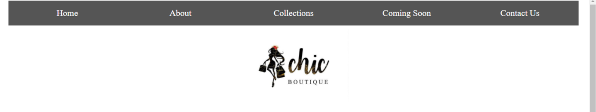
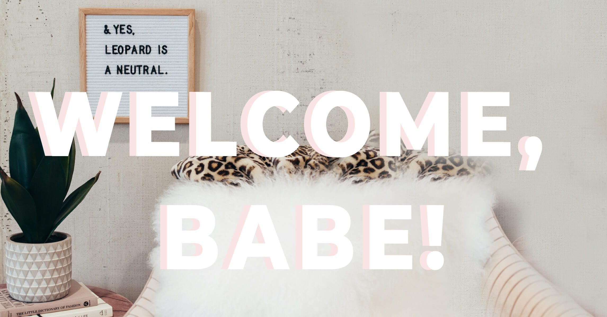

# CHIC BOUTIQUE (Website)

## TABLE OF CONTENTS

- [General Information](https://github.com/Rayr8/Dom-Wesbite-Project#general-information)
- [Languages Used](https://github.com/Rayr8/Dom-Wesbite-Project#languages-used)
- [Features](https://github.com/Rayr8/Dom-Wesbite-Project#features)
- [Screenshots](https://github.com/Rayr8/Dom-Wesbite-Project#screenshots)
- [Live Demo](https://github.com/Rayr8/Dom-Wesbite-Project#live-demo)
- [Setup](https://github.com/Rayr8/Dom-Wesbite-Project#setup)
- [Usage](https://github.com/Rayr8/Dom-Wesbite-Project#usage)
- [Contributing](https://github.com/Rayr8/Dom-Wesbite-Project#contributing)
- [Project Status](https://github.com/Rayr8/Dom-Wesbite-Project#project-status)
- [Authors](https://github.com/Rayr8/Dom-Wesbite-Project#authors)
- [Acknowledgments](https://github.com/Rayr8/Dom-Wesbite-Project#acknowledgements)

## GENERAL INFORMATION

Chic Boutique is a basic website to familiarise and practice intermediate HTML, CSS and basic JavaScript. 
This website code was written using Virtual Studio Code.

## LANGUAGES USED

- HTML
- CSS
- JavaScript 

## FEATURES

All the features below were created with HTML and CSS:
- Home page with icons 
- Navigation bar
- Responsive Social Media Icons
- About page with onclick button
- Coming Soon with a slideshow using Javascript
- Contact Us with a contact form with onclick button 

## SCREENSHOTS

 

## LIVE DEMO

[Live Demo Link](https://raw.githack.com/Rayr8/fashion/main/index.html)

## SETUP

#### Getting Started

To get a local copy up and running clone or download this repository to your local workstation.

#### Prerequisites

Visual Studio Code (or a code editor of your choice)

## USAGE

Enter the directory where you cloned or downloaded the project and open index.html using your favourite browser.

## CONTRIBUTING

**Contributions, issues and feature requests are welcome.**

*If you see something wrong or not working, please check the issue tracker section, if that problem you met is not in already opened issues then open the issue by clicking on new issue button.* 

*If you have a solution to that, and you are willing to work on it, follow the below steps to contribute:* 

*a) Fork this repository.* 

*b) Clone it on your local computer by running https://github.com/Rayr8/.git.* 

*c) Replace Rayr8 with the username you use on github.* 

*d) Open the cloned repository which appears as a folder on your local computer with your favorite code editor.* 

*e) Create a separate branch off the master branch.* 

*f) Write your codes that will fix the issue you found.*

*g) Commit and push the branch you created.*

*h) Raise a pull request, comparing your new created branch with our original master branch.*

## PROJECT STATUS 

The project is completed. 

Give us a :star: if you like this project!

## AUTHORS

- :bust_in_silhouette: **Raeesah Ismail** 
  - GitHub: [@Rayr8](https://github.com/Rayr8)

## ACKNOWLEDGEMENTS

- Girlcode
- [Rumbie-Mudzie7](https://github.com/Rumbie-Mudzie7)
- W3schools

<!-- PROJECT NAME

Chic Boutique Website

Table of Contents
* General Information
* Language used
* Features
* Screenshots
* Setup
* Usage 
* Project Status
* Room for improvement
* Acknowledgments
* Contact

GENERAL INFORMATION

Chic Boutique is a basic website to familiarise and practice intermediate HTML, CSS and basic JavaScript. 
This website code was written using Virtual Studio Code.

LANGUAGES USED

*HTML 

*CSS

*JavaScript

FEATURES
* Responsive Navigation Bar
* Contact Form
* Responsive Social Media Icons
* Slideshow 

SCREENSHOT

LIVE DEMO

[Live Demo](https://raw.githack.com/Rayr8/fashion/master/index.html)

SETUP

Getting Started

To get a local copy up and running follow these simple steps:

Clone or download this repository to your local workstation.

PREREQUISITES

Web Browser
Visual Studio Code

USAGE

Enter the directory where you cloned or downloaded the project and open index.html using your favourite browser.

CONTRIBUTING

*Contributions, issues and feature requests are welcome. 
*If you see something wrong or not working, please check the issue tracker section, if that problem you met is not
 in already opened issues then open the issue by clicking on new issue button. 
*If you have a solution to that, and you are willing to work on it, follow the below steps to contribute: Fork this repository.
*Clone it on your local computer by running https://github.com/Rayr8/fashion.git. Replace Rayr8 with the username you use on github.
*Open the cloned repository which appears as a folder on your local computer with your favorite code editor. 
*Create a separate branch off the master branch.
*Write your codes which fix the issue you found Commit and push the branch you created Raise a pull request, 
 comparing your new created branch with our original master branch here

PROJECT STATUS
Project is in progress. As more concepts regarding HTML, CSS and JavaScript are learnt, these concepts will be applied to the website 
to improve on it.

ROOM FOR IMPROVEMENT 
* Add a rating under each clothing item
* Add a Add to cart 
* Add a checkout cart
* Add a payment portal 

SHOW YOUR SUPPORT

Give a * if you like this project.

AUTHOR

*Raeesah Ismail 

*Twitter: Raeesahi25 

*Github: Rayr8

ACKNOWLEDGEMENTS

*Girlcode

*Rumbie Mudzie

*W3schools

 -->